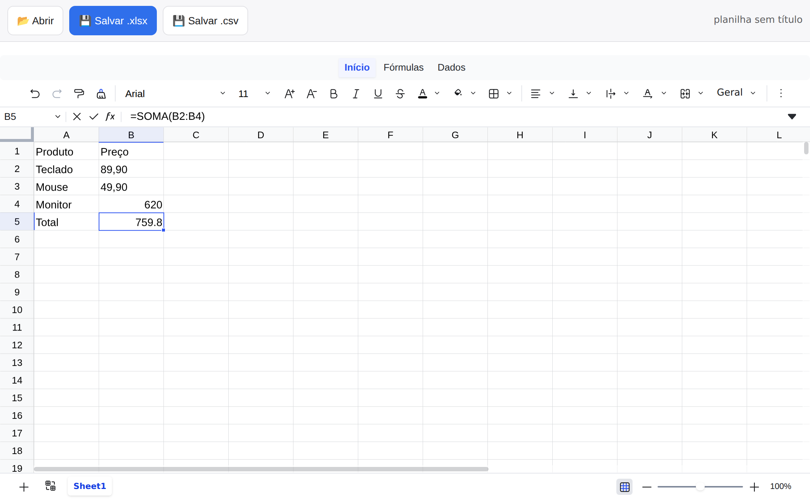

# PlanilhaLivre

Repositório: https://github.com/Reinaldo-rNeto/planilha-livre

App open source para visualizar e editar arquivos `.xlsx` e `.csv` direto no navegador (PWA), sem precisar de licença de Excel e sem depender de Google Drive/Sheets.



## Objetivo

Surgiu de uma dor bem concreta: trabalho com ciência de dados, mexo com planilha o tempo todo, não tenho licença de Excel, e cansei de ter que subir arquivo no Google Drive/Planilhas só pra dar uma olhada rápida ou mudar uma célula. Quem trabalha com dados sem licença corporativa de Office provavelmente passa pela mesma coisa — então a ideia é resolver isso pra quem tá nessa situação também, não só pra mim.

A meta é ocupar o espaço que LibreOffice Calc e OnlyOffice ocupam hoje, só que mais simples, mais leve e pensado pra celular desde o início — sem apostar em viralizar. É construir algo genuinamente usável, que cresce por ser bom nesse nicho (mobile, zero fricção, abre na hora), não por efeito de rede.

## Requisitos não-negociáveis

- Aguentar bem arquivos grandes — dezenas de milhares de linhas — sem travar.
- Mobile-first de verdade: interface e interações desenhadas pra toque desde o início.
- Zero fricção: abrir e salvar um arquivo local, sem conta, sem login, sem passar por nuvem por padrão.

## Escopo do MVP

- Abrir, editar e salvar `.xlsx` e `.csv` inteiramente no navegador (client-side, sem servidor)
- Fórmulas comuns (soma, média, se, procv etc.)
- Formatação básica de células
- Funciona offline (PWA, service worker)
- Sem conta/login obrigatório; nada sai do dispositivo — abrir/salvar é sempre um arquivo local, sem passar por servidor

Fora do escopo por enquanto: macros/VBA, tabelas dinâmicas, gráficos avançados, colaboração em tempo real.

## Stack técnica

- **Motor de planilha:** [Univer](https://github.com/dream-num/univer) (Apache 2.0) — engine de fórmulas própria e renderização em canvas, o que permite rolar planilhas grandes sem travar o navegador. Pacotes: `@univerjs/presets` + `@univerjs/preset-sheets-core`.
- **Import/export de xlsx/csv:** feito com **SheetJS**, não com o recurso nativo do Univer — o import/export de fábrica do Univer depende dos pacotes `@univerjs-pro` (camada comercial) e de um backend de conversão, o que quebraria os requisitos de open source e zero servidor. `src/xlsx-bridge.ts` faz essa conversão manualmente pro formato de dados do Univer (`IWorkbookData`).
- **Offline:** PWA via `vite-plugin-pwa` (service worker com auto-update).
- **Por que não HyperFormula:** é licenciado em GPLv3 (grátis só se o produto todo for GPL) ou pago; o motor de fórmulas próprio do Univer já é Apache 2.0.

## Como rodar

```bash
npm install
npm run dev       # ambiente de desenvolvimento
npm run build     # build de produção (gera dist/)
npm run preview   # serve o build de produção
```

Nota: o pacote `xlsx` do registro público do npm está desatualizado (0.18.5); a SheetJS recomenda instalar a versão atual direto do CDN deles (`npm install https://cdn.sheetjs.com/xlsx-latest/xlsx-latest.tgz`). Ficou pendente porque o ambiente onde isso foi montado bloqueia esse domínio.

## Deploy

`.github/workflows/deploy-pages.yml` publica automaticamente no GitHub Pages a cada push na `main` — zero conta nova pra criar, usa só o que o repositório já tem. Passo manual único (uma vez só): em Settings > Pages do repositório, mudar "Source" pra "GitHub Actions". Depois disso o site fica em `https://reinaldo-rneto.github.io/planilha-livre/`.

Se preferir Vercel ou Netlify no lugar (dá cabeçalhos de segurança customizados tipo CSP, o que o GitHub Pages não permite configurar): é só conectar o repositório lá, ambos detectam Vite automaticamente — nesse caso não precisa do `--base`, porque os dois servem na raiz do domínio.

## Validado até agora

- **Performance:** csv de 50.000 linhas × 12 colunas abre em ~1,85s e exporta pra xlsx em ~2,8s (arquivo final ~8,5MB); dados conferidos byte a byte no round-trip.
- **Mobile:** edição por toque (duplo toque + digitar + Enter) testada em viewports de 360×740 e 390×844; o ribbon do Univer colapsa bem em tela estreita.
- **Offline:** app carrega normalmente depois de simular perda de internet, com o service worker já tendo feito o precache.
- Suporte a instalação (`beforeinstallprompt` no Android/desktop, meta tags de `apple-mobile-web-app-*` no iOS), com ícone próprio (grade de planilha com a célula ativa em destaque, não é mais o placeholder de letras).
- **Testado em celular real** (além do Chromium via Playwright).
- **Fórmulas sobrevivem ao salvar/reabrir:** antes, qualquer fórmula (nossa ou de um arquivo importado) virava só o último valor calculado — `sheet_to_json` descarta fórmula. Agora a leitura e a escrita são feitas célula por célula preservando o campo `f`; testado digitando `=SUM(A1:A2)`, exportando e reabrindo — a fórmula continua lá, não só o número.
- **Peso do que fica cacheado pra uso offline:** o Univer carrega ~77 arquivos de padrões de hifenização (um por idioma, usados só pra justificar parágrafo em texto rico) via import dinâmico — nenhum é necessário pra abrir/editar/salvar planilha. Sem filtrar isso, o service worker baixava e guardava ~11MB de uma vez só pra instalar o app; ajustando o `workbox.globPatterns` no `vite.config.ts` pra só precachear o que o app de fato usa (bundle principal, css, ícones, manifest), caiu pra ~6,1MB. Reconferido com o teste de carga depois da mudança: sem regressão (50k linhas seguem abrindo em ~1,4-1,85s).
- **Bundle principal um pouco mais magro:** o Univer detecta o idioma do texto (`franc-min`, com dicionário de ~30 idiomas) só pra decidir qual hifenização carregar — mesmo recurso do item acima, desligado por padrão e sem UI pra ligar no app. Troquei essa dependência por um stub (`src/stubs/franc-min-stub.ts`, via alias no `vite.config.ts`) que sempre devolve "idioma desconhecido", o mesmo resultado que já acontecia na prática. De 1,77MB pra 1,71MB gzip. Retestado com texto acentuado, emoji/CJK e fórmula — sem diferença visual nem de comportamento.
- **Fórmulas digitadas em português (SOMA, MÉDIA, SE, PROCV) agora funcionam** — não interceptando a digitação (não achei um jeito seguro de fazer isso, ver limitação abaixo), mas registrando as quatro como funções próprias (`src/formulas-ptbr.ts`), usando a mesma API pública que o Univer oferece pra função customizada (`univerAPI.getFormula().registerFunction`). Testado digitando `=SOMA(A1:A3)`, `=MÉDIA(A1:A3)`, `=SE(A1>5,"maior","menor")` e `=PROCV(2,D1:E3,2,FALSO)` direto no app: calculam certo, a barra de fórmula mostra o texto em português, e sobrevive a salvar/reabrir (testado round-trip completo: digitar, exportar .xlsx, reabrir em outra aba do app, fórmula e valor intactos).
- **Corrigido: menus do Univer com texto invisível no celular com tema escuro do sistema** — o Univer injeta seus próprios menus/painéis (autocompletar fórmula, seletor de fonte etc.) direto no `body`, por fora da nossa área da página; nosso CSS de modo escuro definia a cor do texto no `html`/`body` inteiro, e como esses painéis do Univer são sempre de fundo branco (não têm tema escuro próprio), o texto herdava nosso "quase branco" do modo escuro e ficava branco em cima de branco — só os ícones apareciam. Corrigido restringindo a cor de texto do modo escuro só à nossa barra de ferramentas e status (`src/style.css`), que são os únicos elementos realmente nossos. Retestado simulando Android em modo escuro: os menus do Univer voltaram a mostrar texto legível.

Tudo isso testado em Chromium via Playwright, e o essencial (abrir arquivo, editar por toque, salvar) também num celular real.

## Pendências conhecidas

- **SOMA/MÉDIA/SE/PROCV só funcionam dentro do PlanilhaLivre** — o arquivo `.xlsx` exportado guarda a fórmula com esse nome em português mesmo (confirmado: `A4.f = "SOMA(A1:A3)"` no arquivo salvo), porque agora "SOMA" é uma função de verdade pro nosso app, não uma tradução visual como no Excel de verdade. Isso é diferente de `SUM`/`AVERAGE`/`IF`/`VLOOKUP`, que são nomes padrão do formato xlsx e funcionam em qualquer programa. Se você abrir esse arquivo no Excel ou LibreOffice de verdade, essas quatro fórmulas em português vão dar erro (`#NAME?`) — abrir de volta no PlanilhaLivre funciona sempre. Fórmulas digitadas em inglês, ou fórmulas de um arquivo importado (mesmo que o Excel mostre em português na tela), não têm esse problema porque já são o nome padrão. Não implementei o PROCV inteiro — só a correspondência exata (4º argumento `FALSO`) e a aproximada assumindo a 1ª coluna já ordenada (o mesmo que o Excel faz com o 4º argumento de fora), sem replicar toda a semântica de erro do VLOOKUP oficial.
- **Código que o navegador baixa pra rodar o app continua grande:** ~6,1MB (1,71MB gzip) mesmo depois do ajuste acima. Analisei o bundle módulo por módulo (`rollup-plugin-visualizer`): o que pesa de verdade é `@univerjs/sheets-ui`, `engine-formula`, `sheets-formula`, `docs-ui` e `sheets` — ou seja, a própria edição de célula, o motor de fórmula e o editor de texto rico — não tem gordura óbvia pra cortar sem risco. Reduzir isso de verdade exigiria trocar o preset completo por pacotes de nível mais baixo do Univer e montar a integração na mão (refactor maior, com risco real de quebrar funcionalidade já validada) — não fiz sem avaliar com calma.
- **Sem autosalvamento entre sessões** — hoje o trabalho só é salvo quando você clica em "Salvar .xlsx"/"Salvar .csv"; atualizar ou fechar a aba sem salvar perde o que não foi salvo. O plano original (README antigo) citava persistência em IndexedDB/localStorage, mas isso nunca foi implementado — corrigi a descrição do escopo pra não prometer algo que não existe. Dá pra resolver guardando um snapshot automático em IndexedDB, mas é uma feature nova, não fiz sem você pedir.
- **No toque, tocar numa célula já abre o teclado e arrastar o dedo só estende a seleção (não rola a tela)** — testado em celular real. Causa raiz: o Univer tem duas interfaces separadas, uma pra desktop e outra pra toque (chamada de "mobile UI" pelo próprio projeto), e a documentação oficial descreve a versão touch como **experimental** ("some features may be incomplete"). O preset que usamos aqui (`@univerjs/preset-sheets-core`, a forma simplificada de configurar o Univer) só vem com a interface de desktop — não existe nem uma opção de configuração pra ligar o modo touch nele; pra usar o oficial seria preciso desmontar esse preset e montar os pacotes de nível mais baixo do Univer na mão, trocando a peça de interface (`UniverSheetsUIPlugin` → `UniverSheetsMobileUIPlugin`). No modo desktop, um clique já significa "selecionar e preparar pra editar" (não existe a distinção toque-simples-seleciona / toque-duplo-edita), por isso o teclado abre a qualquer toque; e arrastar é interpretado como arrastar o mouse selecionando células, porque rolar no desktop normalmente é feito pela roda do mouse ou barra de rolagem, não arrastando. Decisão: manter assim por agora — o app funciona no toque (abre, edita, salva, como já testado em celular real), só não é confortável ainda; a troca pra interface touch oficial fica pra quando ela madurar mais, já que trocar agora arrisca troca um conjunto de problemas por outro, ainda experimental segundo o próprio Univer.

## Status

Esqueleto funcional: abrir/editar/salvar xlsx e csv de ponta a ponta, com performance, mobile (validado em celular real), offline, instalação (com ícone próprio) e persistência de fórmulas validados por teste automatizado, e só 1 vulnerabilidade "high" restante no `npm audit` (era 95 — as outras 94 eram o `nanoid` desatualizado usado por dependências internas do Univer que nem chegamos a importar; corrigido travando a versão via `overrides` no `package.json`). A que restou é o pacote `xlsx` desatualizado do registro do npm, que resolve trocando pelo tarball do CDN da SheetJS. Fórmulas digitadas funcionam tanto em inglês quanto em português (SOMA, MÉDIA, SE, PROCV) — essas quatro em português só dentro do PlanilhaLivre, ver pendência acima sobre abrir o arquivo exportado em Excel/LibreOffice de verdade. O que ainda fica de decisão em aberto: vale a pena o refactor maior pra reduzir mais o bundle de código.

## Segurança

Revisão feita antes de publicar (checklist padrão de segredos/auth/banco/infra). A maior parte não se aplica porque o app não tem servidor, banco, login nem chamada de rede — tudo roda no navegador da própria pessoa, com o arquivo dela. O que foi conferido de fato:

- Sem segredo/token/chave commitado no repositório ou no histórico do git.
- Sem `innerHTML`/`dangerouslySetInnerHTML` com dado do usuário (nome de arquivo e afins usam `textContent`, que escapa automaticamente) — sem vetor de XSS.
- Sem `fetch`/requisição de rede — o app não manda nada pra fora do dispositivo.
- Dependências: `npm audit` só com 1 pendência conhecida e documentada (ver "Status").
- Risco real, não hipotético: a vulnerabilidade do `xlsx` desatualizado (ReDoS/prototype pollution) importa mais aqui do que em uso normal, porque o app processa arquivo de terceiro sem sandbox — um `.xlsx` malicioso poderia travar a aba. É o mesmo item pendente de sempre; resolver = trocar o pacote pela versão atual da SheetJS.
- Headers de segurança (CSP, X-Frame-Options): não configurados ainda. GitHub Pages não permite customizar headers; se hospedar em Vercel/Netlify, dá pra adicionar depois — baixo risco pra esse app (sem XSS conhecido, sem dado sensível de terceiro), mas é a próxima camada de defesa se quiser reforçar.

## Licença

Apache 2.0 (mesma licença do Univer, a peça central da stack) — ver [`LICENSE`](./LICENSE).
